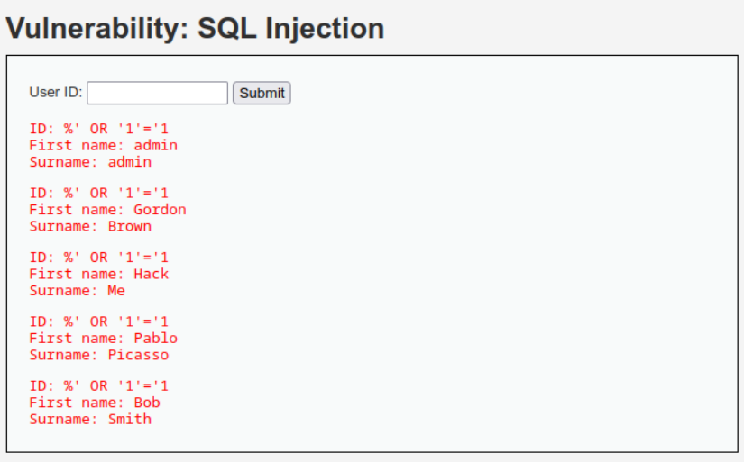
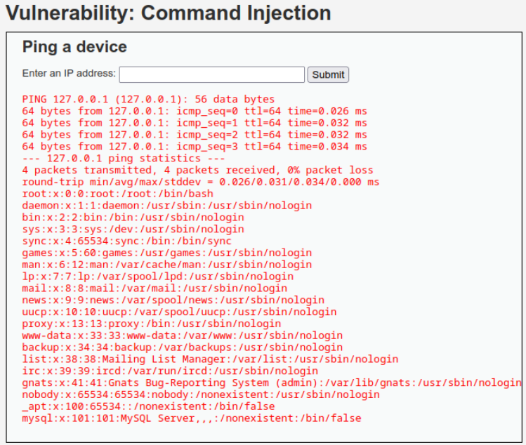
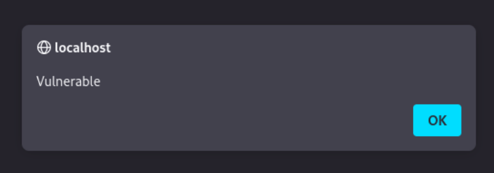
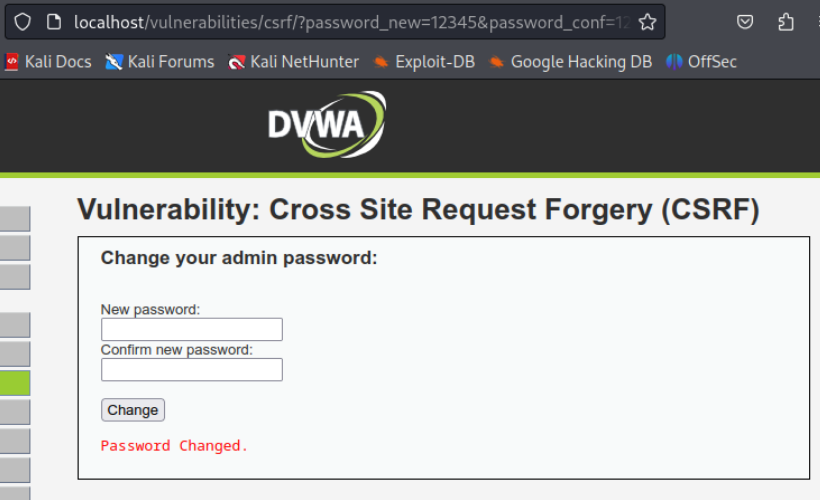
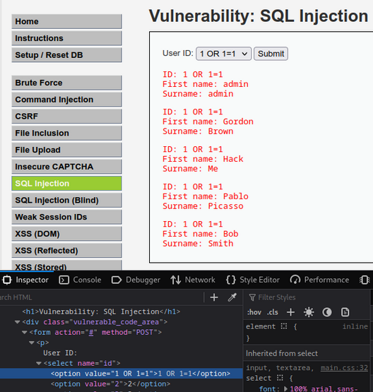
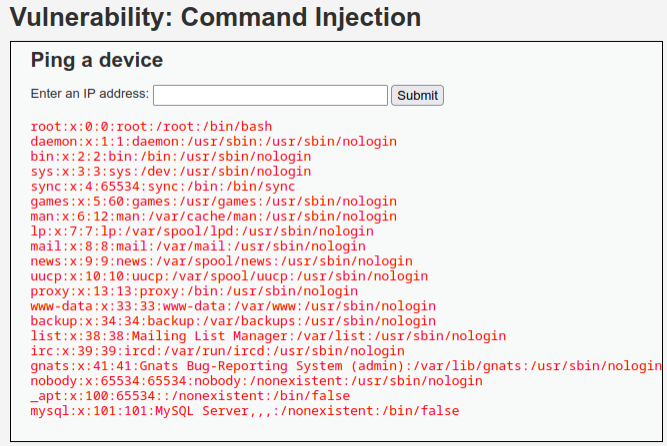
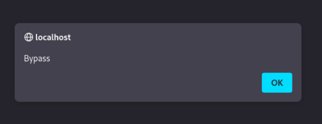
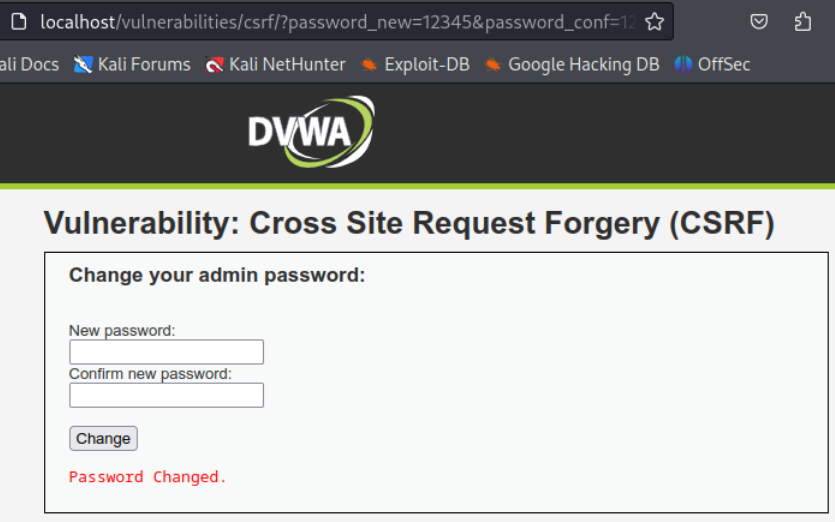

# **1. LOW**

## **1.1. SQL Injection**

**Comando:** %' OR '1'='1

**Explicación:** Como la aplicación une directamente tu texto con la consulta de la base de datos sin revisar nada, la condición '1'='1' siempre es verdadera. Esto provoca que la base de datos te devuelva todos los usuarios y contraseñas del sistema.

## **1.2. Command Injection**

**Comando:** 127.0.0.1; cat /etc/passwd

**Explicación:** El punto y coma le dice al sistema "Haz ping y ejecuta la siguiente orden". El comando “cat /etc/passwd” devolverá el contenido del archivo passwd.

## **1.3. Reflected Cross Site Scripting (XSS)**

**Comando:** \<script\>alert('Vulnerable')\</script\>

**Explicación:** La aplicación toma lo que escribes y lo estampa directamente en la página web sin limpiarlo. El navegador piensa que es una orden legítima de código y ejecuta la alerta JavaScript.

## **1.4. RefCross Site Request Forgery (CSRF)**

**Comando:** 12345

**Explicación:** Como la contraseña vieja no es requerida ni existen tokens de seguridad de validación, cualquier enlace con esos parámetros cambiará la contraseña de forma automática si la víctima tiene la sesión iniciada en otra pestaña.

# **2. MEDIUM**

## **2.1. SQL Injection**

**Comando:** 1 OR 1=1

**Explicación:** El servidor usa funciones para bloquear comillas, pero como el valor que espera es un número, la consulta no lleva comillas en el código interno. Al inyectar el número junto al OR 1=1, la consulta se vuelve a cumplir siempre y vuelve a mostrar todo.

## **2.2. Command Injection**

**Comando:** 127.0.0.1 | cat /etc/passwd

**Explicación:** El servidor del nivel medio está programado para borrar los símbolos “;” y “&&”. Sin embargo, olvidaron filtrar la pipe. Esta barra ejecuta directamente el segundo comando encadenado en la consola.

## **2.3. Reflected Cross Site Scripting (XSS)**

**Comando:** \<sCrIpT\>alert('Bypass')\</sCrIpT\>

**Explicación:** El filtro del servidor busca estrictamente el texto “\<script\>” en minúsculas. Al cambiar las letras a mayúsculas, el filtro no lo detecta, pero el navegador web sí lo entiende perfectamente como código ejecutable.

## **2.4. RefCross Site Request Forgery (CSRF)**

**Comando:** 12345

**Explicación:** Como la contraseña vieja no es requerida ni existen tokens de seguridad de validación, cualquier enlace con esos parámetros cambiará la contraseña de forma automática si la víctima tiene la sesión iniciada en otra pestaña.
